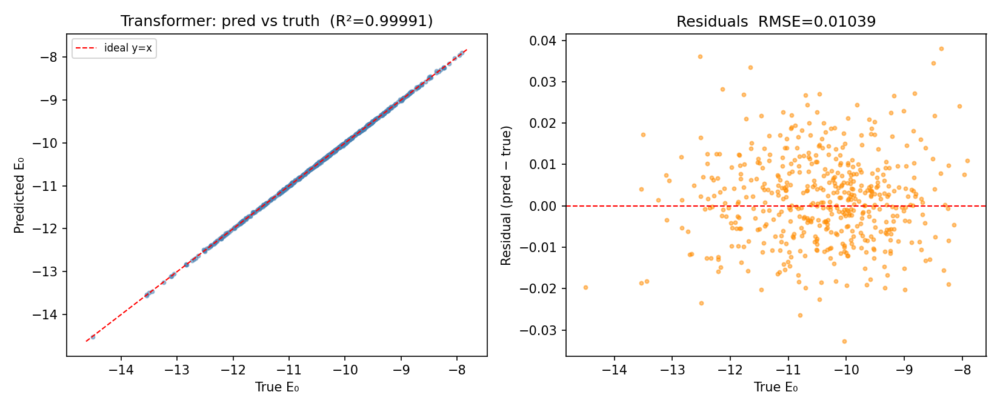
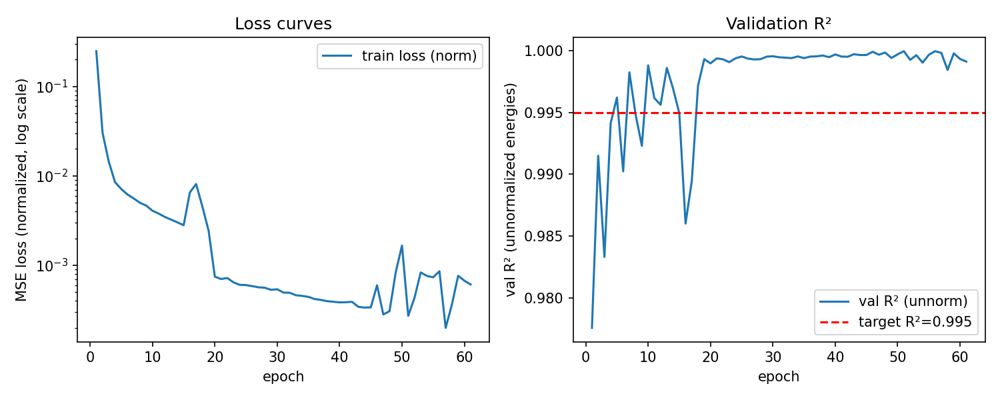

<div align="center">

# Quantum Structure in Neural Representations

### Do transformers trained on quantum data develop quantum-structured internal representations?

[](https://github.com/miheer-smk/quantum-structure-sae/actions/workflows/ci.yml)
[](https://github.com/miheer-smk/quantum-structure-sae/actions)
[](https://www.python.org/downloads/)
[](LICENSE)
[](https://arxiv.org/search/)

*Miheer Kulkarni — Undergraduate Research, 2026*

</div>

---

We train a classical transformer to predict ground-state energies of the 1D **Transverse-Field Ising Model** (TFIM) from per-site Hamiltonian parameters, then apply **TopK Sparse Autoencoders** to its residual-stream activations. The central question: do the features discovered by the SAE correspond to known quantum observables — entanglement entropy, spin correlators, order parameters, phase proximity?

If yes, this establishes a new probe of how classical neural networks encode quantum physics in their representations — with implications for both **quantum machine learning** and **mechanistic interpretability**.

---

## Key Results (Week 1)

<div align="center">

| Model | Test R² | Test RMSE | Parameters |
|:---|:---:|:---:|:---:|
| Linear regression | 0.9812 | 0.1501 | 9 |
| Degree-2 polynomial | 0.9989 | 0.0366 | 45 |
| **TFIMTransformer (ours)** | **0.9999** | **0.0104** | 152,833 |

*L = 8 sites, h_i ~ Uniform(0.1, 2.0), 50k train / 5k test, wide-h regime.*

</div>

The transformer achieves **3.5× lower RMSE than a degree-2 polynomial baseline**, confirming the prediction task contains structure beyond polynomial approximation. Transformer advantage is concentrated in the crossover region near the quantum critical point g_c = 1, where correlations are long-range and polynomial approximation breaks down.

<div align="center">

<br/>
<sub><i>Left: transformer predictions vs exact diagonalisation energies (R² = 0.9999). Right: residuals, RMSE = 0.0104.</i></sub>
</div>

<br/>

<div align="center">

<br/>
<sub><i>Training converged at epoch 46 (early stop). Val R² crosses 0.999 within 10 epochs.</i></sub>
</div>

See [`docs/week1_results.md`](docs/week1_results.md) for the full analysis, including the **narrow-h negative result** and its physical interpretation.

---

## Method Overview

```
TFIM Hamiltonian parameters  →  TFIMTransformer  →  E₀ prediction  (R² = 0.9999)
         h_i ∈ R^L                                      (Week 1 ✅)

Residual stream activations  →  TopK SAE  →  Sparse features
         (N, d_model)                           (N, d_hidden)         (Week 3 🔄)

Sparse features  ←→  Quantum observables  (Pearson correlation)
  {z_f}              S(ρ_A), ⟨Z_iZ_j⟩, ⟨X_i⟩, |⟨Z⟩|, δ_c       (Week 3 🔄)
```

**Observables computed by exact diagonalisation** (`src/qsae/observables.py`):

| Observable | Symbol | Physical meaning |
|:---|:---:|:---|
| Half-chain entanglement entropy | S(ρ_A) | Quantum information content across bipartition |
| Nearest-neighbour ZZ correlator | ⟨Z_i Z_{i+1}⟩ | Ferromagnetic order density |
| Transverse magnetization | ⟨X_i⟩ | Paramagnetic order parameter |
| Longitudinal order parameter | \|⟨Z_i⟩\| | Symmetry-breaking magnitude |
| Phase proximity | δ = (h−h_c)/h_c | Signed distance from quantum critical point |

---

## Quickstart

```bash
git clone https://github.com/miheer-smk/quantum-structure-sae.git
cd quantum-structure-sae
python -m venv .venv && source .venv/bin/activate   # Windows: .venv\Scripts\activate
pip install -e ".[dev]"
pytest -v                       # 32 tests, ~7 seconds
python scripts/smoke_test.py    # end-to-end QNN → shadow → SAE pipeline
```

### Reproduce Week 1

```bash
# Train transformer (generates ~50k TFIM samples via exact diagonalisation)
python scripts/exp_ra01_train_transformer.py
# → runs/ra01_train/best.pt   (R² > 0.999 in ~6 min on CPU)

# Baseline comparison: linear, poly-2 vs transformer
python scripts/ra01_baseline_check.py --ckpt runs/ra01_train/best.pt
```

### Run Week 3 (observable correlation experiment)

```bash
python scripts/exp_ra02_observables.py --ckpt runs/ra01_train/best.pt
# → runs/ra02_observables/correlation_heatmap.png
# → runs/ra02_observables/top_features.json
```

---

## Repository Structure

```
src/qsae/
├── observables.py       ← quantum observables: entropy, ZZ, magnetization, phase
├── sae.py               ← TopK Sparse Autoencoder (Gao et al. 2024)
├── shadows.py           ← classical shadow tomography (Huang-Kueng-Preskill 2020)
├── datasets.py          ← TFIM ground states, Bars-and-Stripes, MNIST-4x4
├── metrics.py           ← polysemanticity, universality, dead-feature fraction
├── training.py          ← training loops (QNN + SAE)
├── qnn.py               ← PennyLane variational quantum circuits
└── reverse_arrow/
    ├── transformer.py   ← TFIMTransformer (Pre-LN encoder + MLP head)
    └── data.py          ← disordered-TFIM dataset, exact diagonalisation kernel

scripts/
├── exp_ra01_train_transformer.py   ← Week 1: train transformer
├── ra01_baseline_check.py          ← Week 1: baseline comparison + plots
├── exp_ra02_observables.py         ← Week 3: SAE on activations + correlations
├── exp01_bas3.py                   ← Bars-and-Stripes 3×3 QNN experiment
└── smoke_test.py                   ← end-to-end sanity check (~10 s)

tests/
├── test_sae.py           ← TopK sparsity and reconstruction
├── test_shadows.py       ← shadow estimation vs analytical values
├── test_transformer.py   ← shape, overfit, checkpoint round-trip
└── test_observables.py   ← observables vs product states, GHZ, TFIM ground states

docs/week1_results.md    ← full Week 1 write-up with negative result analysis
notebooks/               ← exploratory Jupyter notebooks
figures/                 ← committed result figures
```

---

## API Examples

```python
# Quantum observables from exact ground states
from qsae.observables import compute_all_observables
from qsae.datasets import tfim_ground_states
import numpy as np

h_values = np.linspace(0.1, 2.0, 200)
states = tfim_ground_states(n=8, h_values=h_values)
obs = compute_all_observables(states, n=8, h_values=h_values)
# obs.keys(): entropy, nn_zz, mean_nn_zz, transverse_mag, mean_x,
#             order_param, phase_proximity
```

```python
# TopK Sparse Autoencoder
from qsae import SAEConfig, TopKSAE
import torch

cfg = SAEConfig(d_in=64, d_hidden=256, k=32)
sae = TopKSAE(cfg)
out = sae(torch.randn(32, 64))
# out: {x_hat, z, recon_loss, aux_loss, loss}
# sae.dead_feature_fraction()  →  fraction of dead neurons
```

```python
# TFIM Transformer
from qsae import TFIMTransformer, TransformerConfig
import torch

cfg = TransformerConfig(L=8, d_model=64, n_heads=4, n_layers=3, d_ff=256)
model = TFIMTransformer(cfg)
energy = model(torch.rand(16, 8))   # (batch,) ground-state energies
```

---

## Roadmap

| Milestone | Status | Notes |
|:---|:---:|:---|
| TFIMTransformer, R² > 0.995 | ✅ | R² = 0.9999 on 5k test set |
| Polynomial + linear baselines | ✅ | 3.5× RMSE improvement over poly-2 |
| `observables.py` + 23 tests | ✅ | Entropy, ZZ, magnetization, phase proximity |
| TopK SAE on residual stream | 🔄 | `exp_ra02_observables.py` ready |
| Feature–observable correlation | 🔄 | Pearson heatmap, top-feature JSON |
| Scaling: L=12, disordered J_ij | ⬜ | Planned month 2 |
| Workshop paper draft | ⬜ | Target: ICLR 2026 workshop |
| Full paper | ⬜ | Target: NeurIPS 2026 |

---

## Citation

```bibtex
@software{kulkarni2026qsae,
  author  = {Kulkarni, Miheer},
  title   = {{Quantum Structure in Neural Representations}:
             Mechanistic Interpretability via Sparse Autoencoders on Quantum Data},
  year    = {2026},
  url     = {https://github.com/miheer-smk/quantum-structure-sae},
  license = {MIT}
}
```

Machine-readable: [`CITATION.cff`](CITATION.cff)

---

## References

1. Gao et al. (2024). *Scaling and evaluating sparse autoencoders.* [arXiv:2406.04093](https://arxiv.org/abs/2406.04093)
2. Bricken et al. (2023). *Towards Monosemanticity.* [Anthropic Research](https://transformer-circuits.pub/2023/monosemantic-features)
3. Huang, Kueng & Preskill (2020). *Predicting many properties of a quantum system from very few measurements.* Nature Physics. [doi:10.1038/s41567-020-0932-7](https://doi.org/10.1038/s41567-020-0932-7)
4. Cerezo et al. (2021). *Variational quantum algorithms.* Nature Reviews Physics. [doi:10.1038/s42254-021-00348-9](https://doi.org/10.1038/s42254-021-00348-9)
5. Sachdev (2011). *Quantum Phase Transitions* (2nd ed.). Cambridge University Press.

---

<div align="center">
<sub>MIT License · Miheer Kulkarni · Undergraduate Research 2026</sub>
</div>
