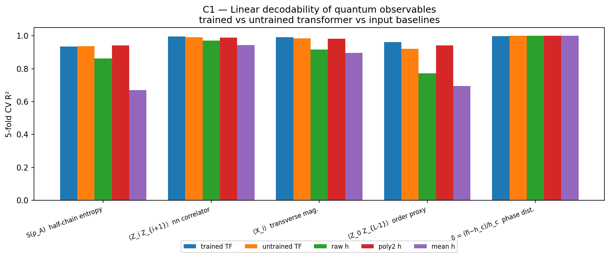

<div align="center">

# Quantum Structure in Neural Representations

**Do transformers trained on quantum data develop quantum-structured internal representations?**

[](https://github.com/miheer-smk/quantum-structure-sae/actions/workflows/ci.yml)
[](https://github.com/miheer-smk/quantum-structure-sae/actions)
[](https://www.python.org/downloads/)
[](LICENSE)
[](https://arxiv.org/search/)

*Miheer Kulkarni · Undergraduate Research · 2026*

</div>

---

## Abstract

We train a classical transformer to predict ground-state energies of the 1D
**Transverse-Field Ising Model** (TFIM) from per-site Hamiltonian parameters
(test R² = 0.9999), then ask — primarily via **linear probing**, with **TopK
Sparse Autoencoders** as a secondary lens — whether its residual-stream
activations encode known quantum observables: entanglement entropy, spin
correlators, the ferromagnetic order parameter, phase proximity.

> **A note on method emphasis.** The paper-level claims are made at the level of
> the *representation* (basis-independent linear probes), not individual SAE
> features: a hyperparameter sweep (`exp_ra04_sae_grid.py`) shows the SAE feature
> basis is **not** universal across seeds, so SAEs are used here as an exploratory
> tool and that negative result is reported in full.

The contribution is not a single correlation but a **controlled** answer. A naive
feature↔observable correlation is confounded: every observable is a function of
the field vector **h**, which is the transformer's input, so even a random network
would appear "structured." We therefore pair the correlation experiment with a
five-part control battery (trained-vs-untrained network, permutation null,
partial-correlation on the mean field, depth sweep, cross-seed universality) that
isolates *learned* structure from trivial input dependence — and honestly reports
where the signal is trivial.

**Headline result.** The residual stream linearly encodes the **non-local order
parameter** ⟨Z₀Z_{L-1}⟩ substantially better than an untrained network, the raw
input, a degree-2 polynomial of the input, or the mean field; the effect is stable
across seeds (partial-correlation vs. the mean field = **0.71 ± 0.01**), beats a
strict permutation null (p ≈ 0), and **strengthens with network depth** — evidence
that training induces a genuinely non-local, quantum-structured representation.

**And a twist (causal test).** Activation patching shows this order representation
is **decodable but not load-bearing**: ablating it barely changes the model's energy
prediction (while random directions degrade it ~9×), because it lives in a
low-variance subspace roughly *orthogonal* to the energy-prediction pathway. The
network encodes quantum order it does not strictly need for its task — a cleaner and
more interesting statement than "it uses it."

---

## Highlights

- 🎯 **Energy prediction** — TFIMTransformer reaches test R² = 0.9999, a 3.5×
  RMSE improvement over a degree-2 polynomial baseline.
- 🔬 **Interpretability with controls** — linear probes backed by a permutation
  null, an *untrained-network* control, mean-field partial correlation, and a depth
  sweep. The pipeline reports "trivial" for the observable (phase proximity) that
  *is* trivial.
- 🧭 **Non-local structure is learned** — ⟨Z₀Z_{L-1}⟩ is the one observable where
  training and depth demonstrably help (partial-r = 0.71 ± 0.01 over 3 seeds).
- 🧨 **Causal, not just correlational** — activation patching shows the order
  direction is *decodable but not load-bearing* for the model's task.
- 🧪 **Validated on classical data** — a Bars-and-Stripes QNN→shadow→SAE run
  recovers monosemantic features (fraction 0.61) as a sanity check.
- ✅ **Reproducible** — 40 passing tests, deterministic seeds, a sparse ED solver
  that scales to L ≈ 14, one-command `reproduce_all.sh`, CI on Python 3.10–3.12.

---

## Results

### 1 · Ground-state energy prediction

<div align="center">

| Model | Test R² | Test RMSE | Parameters |
|:---|:---:|:---:|:---:|
| Linear regression | 0.9812 | 0.1501 | 9 |
| Degree-2 polynomial | 0.9989 | 0.0366 | 45 |
| **TFIMTransformer (ours)** | **0.9999** | **0.0104** | 152,833 |

<sub>L = 8 sites, hᵢ ~ Uniform(0.1, 2.0), 50k train / 5k test, wide-h regime.</sub>

</div>

The transformer's advantage concentrates in the crossover region near the quantum
critical point g_c = 1, where correlations are long-range and polynomial
approximation breaks down.

<div align="center">

<br/>
<sub><i>Left: predictions vs exact-diagonalisation energies (R² = 0.9999). Right: residuals, RMSE = 0.0104.</i></sub>
</div>

<sub>Full analysis, including the **narrow-h negative result**, in
[`docs/week1_results.md`](docs/week1_results.md).</sub>

### 2 · Do the representations encode quantum observables?

We train a TopK SAE on the residual stream and probe each observable. Single SAE
features reach |Pearson r| up to **0.91**; but the scientific claim rests on the
controls below (N = 800, 500 permutations — [`docs/week3_results.md`](docs/week3_results.md)).

<div align="center">

**C1 — Linear decodability (5-fold CV ridge R²)**

| Observable | **Trained** | Untrained | Raw h | Poly-2 h | Mean h |
|:---|:---:|:---:|:---:|:---:|:---:|
| Entanglement entropy S(ρ_A) | 0.934 | 0.938 | 0.863 | 0.941 | 0.670 |
| ⟨Zᵢ Z_{i+1}⟩ nn correlator | 0.995 | 0.991 | 0.971 | 0.988 | 0.945 |
| ⟨Xᵢ⟩ transverse mag. | 0.991 | 0.985 | 0.916 | 0.983 | 0.896 |
| **⟨Z₀ Z_{L-1}⟩ order param.** | **0.961** | 0.921 | 0.772 | 0.942 | 0.695 |
| Phase proximity δ | 0.999 | 0.999 | 1.000 | 1.000 | 1.000 |

</div>

- **⟨Z₀Z_{L-1}⟩** is decoded far better by the *trained* network than by an
  untrained one, the raw input, or the mean field — and its decodability rises with
  depth (L0 → L2: 0.92 → 0.96). **Partial-r given the mean field = 0.71 ± 0.01**
  (3 seeds): genuine beyond-mean-field structure.
- **Phase proximity** is perfectly decodable from the mean field alone
  (partial-r = 0.00) — a calibrated *negative control* showing the method does not
  over-claim.
- All best-feature correlations exceed the permutation-null 95th percentile with
  p ≈ 0.

<div align="center">

<br/>
<sub><i>Trained transformer vs untrained network and input-only baselines. The order
parameter (4th group) is where learning clearly helps.</i></sub>
</div>

> **Honest limitation.** The *individual* SAE feature basis is **not** universal
> across seeds (cos > 0.7 fraction ≈ 0.3% at default; a d_hidden × k sweep in
> `exp_ra04_sae_grid.py` peaks at only ~6%, so it is *not* a hyperparameter
> artifact). Claims are therefore made at the level of the representation (probes,
> C1/C2/C4), not individual features. See [`docs/week3_results.md`](docs/week3_results.md) §3.

### 3 · Decodable vs. *used* — a causal test

Correlational controls show the order information is *present*; activation patching
asks whether it is *used*. We ablate the residual direction most predictive of
⟨Z₀Z_{L-1}⟩ and measure the effect on the model's **energy** prediction
([`exp_ra07_causal.py`](scripts/exp_ra07_causal.py)):

<div align="center">

| Ablate | Energy RMSE | ordered (h̄<1) | paramagnetic |
|:---|:---:|:---:|:---:|
| — (baseline) | 0.0112 | 0.0115 | 0.0110 |
| **order direction** | 0.0137 | 0.0125 | 0.0145 |
| random direction (×15) | 0.100 | 0.097 | 0.101 |

</div>

The ablation is genuinely effective — the ⟨Z₀Z_{L-1}⟩ probe R² collapses from 0.97
to −9.6 — yet energy prediction barely moves, while random directions of equal norm
degrade it ~9× more. The residual stream carries ~12× less variance along the order
direction than along a random one. **The order parameter is encoded in a
low-variance, task-orthogonal subspace: represented, but not load-bearing for the
trained objective** — an honest negative for the naive "used" hypothesis, and a
more interesting positive.

### 4 · Pipeline validation on classical data

A 9-qubit **Bars-and-Stripes** QNN→classical-shadow→SAE run
([`docs/exp01_bas_results.md`](docs/exp01_bas_results.md)): QNN test accuracy
**0.979**, SAE **monosemantic fraction 0.611** — the interpretability stack
recovers structure on data whose ground truth is known.

---

## Method Overview

```
TFIM Hamiltonian parameters  →  TFIMTransformer  →  E₀ prediction   (R² = 0.9999)
        hᵢ ∈ Rᴸ                                       [Stage 1 ✅]

Residual-stream activations  →  TopK SAE + probes  →  Sparse features + decodability
        (N, d_model)                                   (N, d_hidden)   [Stage 2 ✅]

Features / activations  ←→  Quantum observables   (correlation + 5 controls)
        {z_f}, h_ℓ           S(ρ_A), ⟨ZᵢZ_j⟩, ⟨Xᵢ⟩, ⟨Z₀Z_{L-1}⟩, δ    [Stage 2 ✅]
```

<sub>Stage 1 → [`docs/week1_results.md`](docs/week1_results.md) · Stage 2 →
[`docs/week3_results.md`](docs/week3_results.md). The `week*` filenames are
historical; see [`RUNBOOK.md`](RUNBOOK.md) for the stage↔document map and the
full two-phase roadmap in [`EXECUTION_PLAN.md`](EXECUTION_PLAN.md).</sub>

**Observables via exact diagonalisation** (`src/qsae/observables.py`):

| Observable | Symbol | Physical meaning |
|:---|:---:|:---|
| Half-chain entanglement entropy | S(ρ_A) | Information across the bipartition |
| Nearest-neighbour ZZ correlator | ⟨Zᵢ Z_{i+1}⟩ | Ferromagnetic order density |
| Transverse magnetization | ⟨Xᵢ⟩ | Paramagnetic order parameter |
| End-to-end ZZ correlator | ⟨Z₀ Z_{L-1}⟩ | Finite-size order parameter |
| Phase proximity | δ = (h−h_c)/h_c | Signed distance from the critical point |

> **Note.** The single-site order parameter mean\|⟨Zᵢ⟩\| vanishes identically at
> finite L by the Z₂ symmetry of the ground state (measured ~10⁻¹³); we use the
> maximal-separation correlator ⟨Z₀Z_{L-1}⟩ as the finite-size order proxy instead.

---

## Installation

```bash
git clone https://github.com/miheer-smk/quantum-structure-sae.git
cd quantum-structure-sae
python -m venv .venv && source .venv/bin/activate    # Windows: .venv\Scripts\activate
pip install -e ".[dev]"

pytest -q                        # 40 tests, ~35 s
python scripts/smoke_test.py     # end-to-end QNN → shadow → SAE (~15 s)
```

## Reproducing the results

```bash
# Everything, one command (FAST=1 for a quick pass, SKIP_BAS=1 to skip the QNN run):
bash scripts/reproduce_all.sh
```

<details>
<summary>…or step by step</summary>

```bash
# --- Stage 1: train the transformer + baselines ----------------------------
python scripts/exp_ra01_train_transformer.py          # → runs/ra01_wide/best.pt
python scripts/ra01_baseline_check.py --ckpt runs/ra01_wide/best.pt

# --- Stage 2: SAE feature ↔ observable correlations ------------------------
python scripts/exp_ra02_observables.py --ckpt runs/ra01_wide/best.pt --n_samples 500

# --- Stage 2: the control battery (C1–C5) — the core analysis --------------
python scripts/exp_ra03_controls.py --ckpt runs/ra01_wide/best.pt \
    --n_samples 800 --n_perm 500 --sae_epochs 200

# --- Stage 2: SAE universality sweep, multi-seed error bars, causal test ---
python scripts/exp_ra04_sae_grid.py --ckpt runs/ra01_wide/best.pt
python scripts/exp_ra06_multiseed.py --seeds 42,43,44
python scripts/exp_ra07_causal.py --ckpt runs/ra01_wide/best.pt

# --- Classical-data validation ---------------------------------------------
python scripts/exp01_bas3.py                          # → runs/exp01/metrics.json
```
</details>

---

## Repository Structure

```
src/qsae/
├── observables.py       ← quantum observables: entropy, ZZ, magnetization, order, phase
├── sae.py               ← TopK Sparse Autoencoder (Gao et al. 2024)
├── shadows.py           ← classical shadow tomography (Huang–Kueng–Preskill 2020)
├── datasets.py          ← TFIM ground states, Bars-and-Stripes, MNIST-4×4
├── metrics.py           ← polysemanticity, universality, dead-feature fraction
├── training.py          ← training loops (QNN + SAE)
├── qnn.py               ← PennyLane variational quantum circuits
└── reverse_arrow/
    ├── transformer.py   ← TFIMTransformer (Pre-LN encoder + MLP head)
    └── data.py          ← disordered-TFIM dataset, exact-diagonalisation kernel

scripts/
├── exp_ra01_train_transformer.py   ← Stage 1: train transformer
├── ra01_baseline_check.py          ← Stage 1: baseline comparison + plots
├── exp_ra02_observables.py         ← Stage 2: SAE on activations + correlations
├── exp_ra03_controls.py            ← Stage 2: control battery (C1–C5)
├── exp_ra04_sae_grid.py            ← Stage 2: SAE universality sweep (C5 revisited)
├── exp_ra06_multiseed.py           ← Stage 2: multi-seed headline (error bars)
├── exp_ra07_causal.py              ← Stage 2: causal activation patching
├── exp01_bas3.py                   ← Bars-and-Stripes 3×3 QNN experiment
├── reproduce_all.sh                ← one command → every result + figure
└── smoke_test.py                   ← end-to-end sanity check

tests/                              ← 40 tests (SAE, shadows, transformer, observables)

docs/
├── week1_results.md        ← Stage 1: transformer training + baselines
├── week3_results.md        ← Stage 2: probes, controls (C1–C5), causal test
└── exp01_bas_results.md    ← Bars-and-Stripes QNN→shadow→SAE validation

paper/workshop_abstract.md  ← 4-page extended-abstract draft
figures/                    ← committed result figures
notebooks/                  ← exploratory Jupyter notebooks
```

---

## API Examples

```python
# Quantum observables from exact ground states
from qsae.observables import compute_all_observables
from qsae.datasets import tfim_ground_states
import numpy as np

h_values = np.linspace(0.1, 2.0, 200)
states = tfim_ground_states(n=8, h_values=h_values)
obs = compute_all_observables(states, n=8, h_values=h_values)
# obs.keys(): entropy, nn_zz, mean_nn_zz, transverse_mag, mean_x,
#             long_range_zz, order_param_proxy, phase_proximity
```

```python
# TopK Sparse Autoencoder
from qsae import SAEConfig, TopKSAE
import torch

cfg = SAEConfig(d_in=64, d_hidden=256, k=32)
sae = TopKSAE(cfg)
out = sae(torch.randn(32, 64))          # {x_hat, z, recon_loss, aux_loss, loss}
sae.dead_feature_fraction()             # fraction of dead latents
```

```python
# TFIM Transformer
from qsae import TFIMTransformer, TransformerConfig
import torch

cfg = TransformerConfig(L=8, d_model=64, n_heads=4, n_layers=3, d_ff=256)
model = TFIMTransformer(cfg)
energy = model(torch.rand(16, 8))       # (batch,) ground-state energies
```

---

## Roadmap

| Milestone | Status | Notes |
|:---|:---:|:---|
| TFIMTransformer, R² > 0.995 | ✅ | R² = 0.9999 on 5k test set |
| Polynomial + linear baselines | ✅ | 3.5× RMSE improvement over poly-2 |
| `observables.py` + tests | ✅ | Entropy, ZZ, magnetization, long-range order, phase |
| TopK SAE on residual stream | ✅ | `exp_ra02_observables.py` — 208 alive features, \|r\| ≤ 0.91 |
| Feature–observable correlation | ✅ | Pearson heatmap + top-feature JSON |
| **Control battery (C1–C5)** | ✅ | `exp_ra03_controls.py` — trained-vs-untrained, permutation null, partial-r, depth sweep, universality |
| Causal activation patching | ✅ | `exp_ra07_causal.py` — order is decodable but not load-bearing |
| Scaling to L = 12 | ✅ | `exp_ra08_scaling.py` — learned gain robust (≈ +0.028), not a finite-size artifact |
| Non-integrable Hamiltonian | ✅ | mixed-field (`--g`) — honest negative: effect needs a beyond-input observable |
| Workshop paper draft | ◑ | `paper/workshop_abstract.md` — draft; port to a venue template |
| Disordered J_{ij} / connected correlator | ⬜ | the clean non-integrable test still outstanding |
| Full paper | ⬜ | Target: a physics-ML venue (see `EXECUTION_PLAN.md`) |

---

## Citation

```bibtex
@software{kulkarni2026qsae,
  author  = {Kulkarni, Miheer},
  title   = {{Quantum Structure in Neural Representations}:
             Mechanistic Interpretability via Sparse Autoencoders on Quantum Data},
  year    = {2026},
  url     = {https://github.com/miheer-smk/quantum-structure-sae},
  license = {MIT}
}
```

Machine-readable metadata: [`CITATION.cff`](CITATION.cff).

---

## References

1. Gao et al. (2024). *Scaling and evaluating sparse autoencoders.* [arXiv:2406.04093](https://arxiv.org/abs/2406.04093)
2. Bricken et al. (2023). *Towards Monosemanticity.* [Anthropic / Transformer Circuits](https://transformer-circuits.pub/2023/monosemantic-features)
3. Huang, Kueng & Preskill (2020). *Predicting many properties of a quantum system from very few measurements.* Nature Physics. [doi:10.1038/s41567-020-0932-7](https://doi.org/10.1038/s41567-020-0932-7)
4. Cerezo et al. (2021). *Variational quantum algorithms.* Nature Reviews Physics. [doi:10.1038/s42254-021-00348-9](https://doi.org/10.1038/s42254-021-00348-9)
5. Sachdev (2011). *Quantum Phase Transitions* (2nd ed.). Cambridge University Press.

---

<div align="center">
<sub>MIT License · Miheer Kulkarni · Undergraduate Research 2026</sub>
</div>
