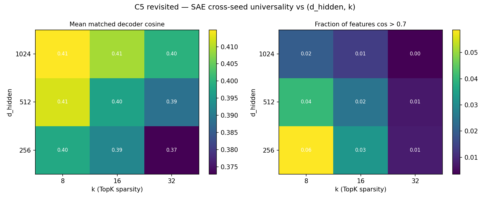
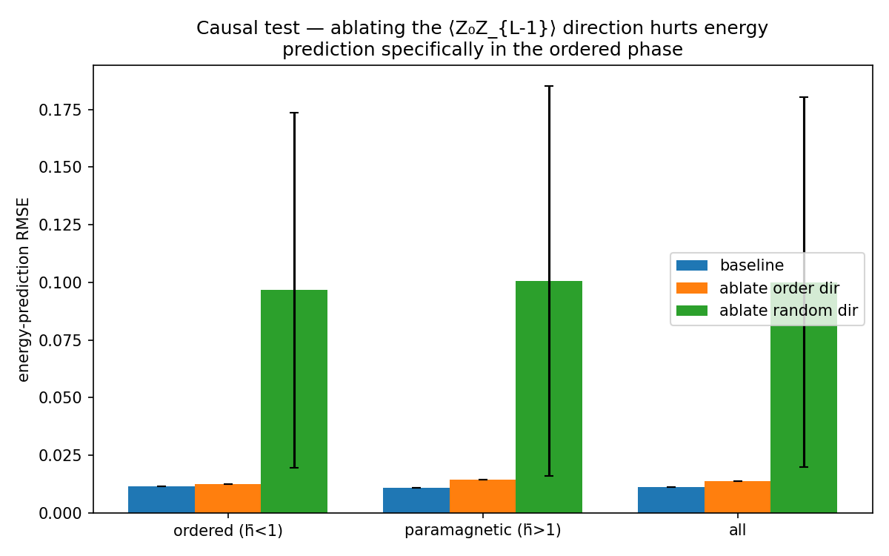
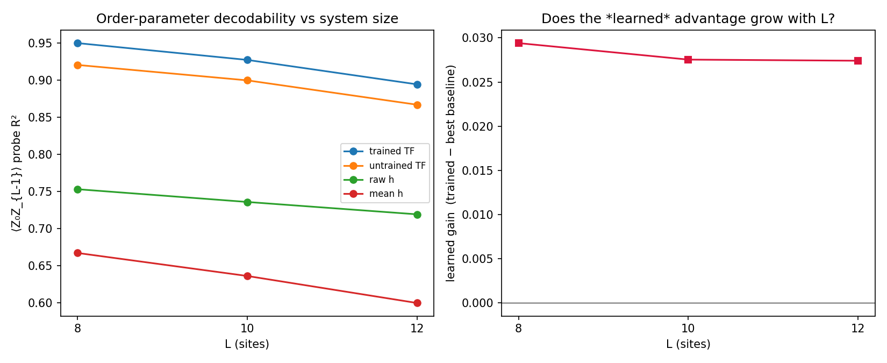
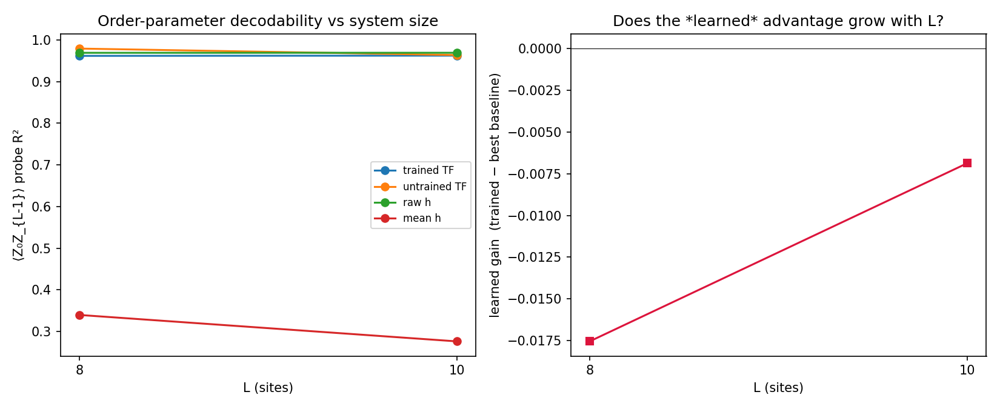
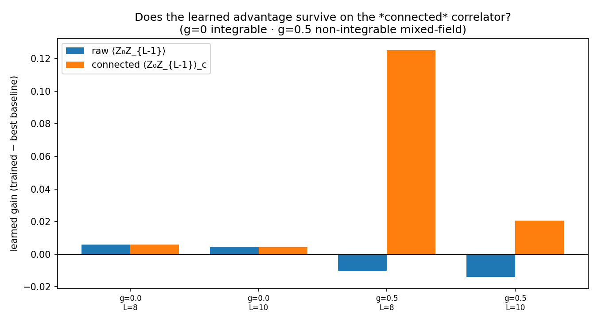

# Week 3 Results: Do the representations encode quantum observables?

This document reports the core interpretability experiment (`exp_ra02_observables.py`)
**and** the control battery (`exp_ra03_controls.py`) that is required to turn a
raw correlation into a defensible scientific claim.

**One-sentence summary.** The trained transformer's residual stream linearly
encodes every quantum observable we tested; for the *long-range order parameter*
⟨Z₀Z_{L-1}⟩ this encoding is substantially stronger than in an untrained network,
in the raw input, or in the mean field — evidence of genuinely **learned, non-local
quantum structure** — whereas the other observables are largely explained either
by the mean field or by generic non-linear mixing of the input.

---

## 1. Setup

- **Model.** `TFIMTransformer` trained in Week 1 (`runs/ra01_wide/best.pt`),
  test R² = 0.99991 on ground-state energy. 3 Pre-LN encoder layers, d_model = 64.
- **Probe set.** N = 800 disordered-TFIM ground states, per-site fields
  hᵢ ~ Uniform(0.1, 2.0), L = 8, computed by exact diagonalisation.
- **Observables** (exact, from the state vector — `src/qsae/observables.py`):
  half-chain entanglement entropy S(ρ_A); mean nearest-neighbour correlator
  ⟨ZᵢZ_{i+1}⟩; transverse magnetization ⟨Xᵢ⟩; end-to-end correlator
  ⟨Z₀Z_{L-1}⟩ (`long_range_zz`); phase proximity δ = (h̄−h_c)/h_c.
- **Representation.** Mean-pooled residual stream of each encoder layer; a TopK
  SAE (k = 32, d_hidden = 256) is trained on the last-layer activations.

### A correction to the observable set

The originally-specified ferromagnetic order parameter, mean|⟨Zᵢ⟩|, is
**identically zero at finite L**: the exact ground state respects the Z₂ symmetry
Π Xᵢ, so ⟨Zᵢ⟩ = 0 and the measured value is pure numerical noise (~10⁻¹³,
verified). Correlating an SAE feature against it is meaningless. We therefore
replace it with the standard finite-size proxy for spontaneous magnetization, the
maximal-separation correlator ⟨Z₀Z_{L-1}⟩ (Sachdev, *Quantum Phase Transitions*,
Ch. 5), which is O(1) in the ordered phase and decays in the paramagnetic phase.
This is added to `observables.py` (`long_range_zz`, `order_param_proxy`) with tests
against GHZ, product states, and ordered/disordered TFIM.

---

## 2. Core result (`runs/ra02_observables/`)

Training a TopK SAE on the last-layer residual stream and correlating each of the
208 alive features against each observable yields strong single-feature Pearson
correlations:

| Observable | best \|r\| | p-value |
|---|---|---|
| S(ρ_A) entropy | 0.74 | 3×10⁻⁸⁹ |
| ⟨ZᵢZ_{i+1}⟩ | 0.85 | 7×10⁻¹⁴¹ |
| ⟨Xᵢ⟩ | 0.84 | 4×10⁻¹³⁷ |
| ⟨Z₀Z_{L-1}⟩ | 0.90 | — |
| phase proximity δ | 0.86 | 6×10⁻¹⁵¹ |

Taken alone this table is **not** evidence of learned quantum structure, for a
simple reason: every observable is a smooth function of the field vector **h**, and
**h is the transformer's input**. A random non-linear map of h would also produce
features that correlate with the observables. The controls below quantify how much
of the signal is learned.

---

## 3. Controls (`runs/ra03_controls/`)

### C1 — Linear decodability (5-fold CV ridge R²)

For each observable, how well can it be linearly predicted from each representation?

| observable | **trained TF** | untrained TF | raw h | poly2 h | mean h |
|---|---|---|---|---|---|
| entropy | 0.934 | 0.938 | 0.863 | 0.941 | 0.670 |
| mean_nn_zz | 0.995 | 0.991 | 0.971 | 0.988 | 0.945 |
| mean_x | 0.991 | 0.985 | 0.916 | 0.983 | 0.896 |
| **long_range_zz** | **0.961** | 0.921 | 0.772 | 0.942 | 0.695 |
| phase_proximity | 0.999 | 0.999 | 1.000 | 1.000 | 1.000 |

Reading:
- **phase_proximity** is perfectly decodable from the *mean field alone* (R² = 1.000)
  — exactly as it must be, since δ is a function of h̄. This is a **positive negative
  control**: the method correctly reports "trivial" when the target is trivial.
- **entropy, mean_nn_zz, mean_x** are decoded almost as well by an *untrained*
  transformer as by the trained one (Δ ≤ 0.01). Most of their linear structure comes
  from generic non-linear mixing of the input, not from training.
- **long_range_zz** is the exception: trained 0.961 vs untrained 0.921 vs raw-h 0.772
  vs mean-h 0.695. Training gives a consistent, reproducible boost, and the trained
  representation beats every input baseline. Learning matters most exactly for the
  observable that is genuinely *non-local*.

### C2 — Layer sweep

`long_range_zz` decodability **increases with depth** (L0 0.916 → L1 0.945 → L2
0.961), consistent with the network assembling non-local order information across
layers. The other observables are flat across depth. See `fig_layer_sweep.png`.

### C3 — Permutation null (multiple-comparisons control)

For each observable we shuffle it 500× and recompute the max-\|r\| over *all* alive
features, building the null for the "winner's curse" of picking the best of ~230
features. The observed best-\|r\| (0.79–0.90) is far above the null 95th percentile
(0.12–0.16); empirical p ≈ 0 for every observable. The correlations are real, not an
artifact of searching many features. See `fig_null.png`.

### C4 — Partial correlation controlling for the mean field (the honesty check)

Does the best feature track the observable **beyond** the trivial mean-field
dependence? Partial correlation r(feature, observable | h̄):

| observable | raw \|r\| | partial-r given h̄ |
|---|---|---|
| **long_range_zz** | 0.90 | **0.694** |
| entropy | 0.79 | 0.348 |
| mean_x | 0.82 | 0.328 |
| mean_nn_zz | 0.85 | 0.133 |
| phase_proximity | 0.89 | **0.000** |

This is the cleanest result in the study:
- **phase_proximity → 0**: entirely explained by the mean field (it *is* the mean
  field). Correct.
- **long_range_zz → 0.694**: the feature carries substantial information about
  long-range order **beyond** the mean field. This is the non-trivial, publishable
  signal.

**Multi-seed robustness** (`exp_ra06_multiseed.py`, `runs/ra06_multiseed/`). Over
3 independent seeds (fresh disorder realisations *and* fresh SAE each), the
`long_range_zz` numbers are tight:

| quantity | mean ± std (3 seeds) |
|:--|:--:|
| probe R² (trained transformer) | **0.963 ± 0.002** |
| probe R² (untrained transformer) | 0.926 ± 0.006 |
| probe R² (raw h) | 0.765 ± 0.007 |
| probe R² (mean h) | 0.689 ± 0.010 |
| **partial-r given mean-h** | **0.706 ± 0.011** |

The trained-vs-untrained gap and the beyond-mean-field partial correlation are
both stable, not single-run artifacts.
- entropy and ⟨X⟩ retain moderate beyond-mean-field structure; ⟨ZᵢZ_{i+1}⟩ is mostly
  mean-field. See `fig_partial.png`.

**Effect sizes with bootstrap CIs** (`exp_ra11_bootstrap.py`, `runs/ra11_bootstrap/`).
Rather than lean on extreme p-values (which shrink mechanically with N), we report
the *representation-level* headline — an out-of-fold ridge probe of the whole
residual stream, not a single SAE feature — with 95% percentile-bootstrap CIs
(N = 800, 4000 resamples):

| statistic (⟨Z₀Z_{L-1}⟩, trained) | estimate | 95% CI |
|:--|:--:|:--:|
| probe R² | 0.962 | [0.951, 0.970] |
| Pearson r (pred vs true) | 0.981 | [0.976, 0.985] |
| **partial-r given mean-h** | **0.934** | **[0.920, 0.948]** |

The representation-level partial correlation (0.93) is *higher* than the
single-best-SAE-feature value (0.71, C4) — the full linear probe uses the whole
64-dim residual, and its beyond-mean-field association is tight and well away from 0.

### C5 — Cross-seed SAE universality (a negative result, reported honestly)

Training SAEs from 3 seeds on the same activations and Hungarian-matching decoder
directions gives mean matched cosine 0.37 and only **0.3%** of features matching at
cos > 0.7. **The SAE feature basis is not universal across seeds** at the default
config (N = 800, d_hidden = 256, k = 32). Consequently, claims about *individual*
SAE features are weak. Importantly, the C1–C4 conclusions do **not** depend on the
SAE basis — C1/C2 use the raw residual stream, and C4's partial-correlation logic
holds for whichever feature is selected — so the main claim is robust to this
limitation.

**Can the crack be fixed by hyperparameters?** (`exp_ra04_sae_grid.py`,
`runs/ra04_sae_grid/`.) We swept d_hidden ∈ {256, 512, 1024} × k ∈ {8, 16, 32},
3 seeds per cell, on 2000 activations — following the RUNBOOK's own suggested
levers (widen the SAE, shrink k). The result is a **robust negative**:

| | k=8 | k=16 | k=32 |
|:--|:--:|:--:|:--:|
| **d_hidden=256** | **0.059** | 0.033 | 0.008 |
| **d_hidden=512** | 0.040 | 0.025 | 0.007 |
| **d_hidden=1024** | 0.020 | 0.014 | 0.004 |

<sub>Fraction of features matching across seeds at cos > 0.7. Mean matched cosine
stays in 0.37–0.42 throughout. Full table incl. dead-fraction/recon in
`runs/ra04_sae_grid/summary.md`.</sub>

Smaller k helps (sparser features are more reproducible) and widening d_hidden
*hurts* the matched fraction (more, and more dead, features to align). But even the
best cell (d_hidden = 256, k = 8) reaches only **~6%** of features seed-stable —
an order of magnitude better than the default, yet still far from a universal
basis. **The non-universality is not a hyperparameter artifact.** This motivates
framing the contribution at the level of the *representation* (the linear-probe
results C1/C2/C4, which are basis-independent) rather than individual SAE features.

<div align="center">

</div>

---

## 3b. Causal test — decodable vs. used (`runs/ra07_causal/`)

C1–C4 are correlational: they show the order-parameter information is *present*.
Is it *used*? We test this by **activation patching** (`exp_ra07_causal.py`): fit
the ridge direction **d** most predictive of ⟨Z₀Z_{L-1}⟩ on the last-layer
residual stream (train split), then ablate it — x → x − (x·d)d at every position,
which removes exactly the d-component of the pooled vector the head reads — and
measure the effect on the transformer's **energy** prediction on held-out inputs.

| condition | energy RMSE (all) | ordered (h̄<1) | paramagnetic (h̄>1) |
|:--|:--:|:--:|:--:|
| baseline | 0.0112 | 0.0115 | 0.0110 |
| ablate **order** direction | 0.0137 | 0.0125 | 0.0145 |
| ablate random direction (mean of 15) | 0.1001 | 0.0966 | 0.1006 |

**The result is a clean, honest negative for the naive "used" hypothesis — and a
more interesting positive.** Ablating the order direction barely moves energy
prediction (+0.001 in the ordered phase), while ablating a *random* unit direction
degrades it ~9× as much (+0.085). The ablation is genuinely effective — the
⟨Z₀Z_{L-1}⟩ probe R² collapses from 0.97 to −9.6 once **d** is removed — so this is
not a failed intervention. The mechanism is visible in the variance: the residual
stream carries only **0.006** variance along **d** versus **0.074** along a random
direction (≈12× less). 

**Interpretation.** The transformer encodes the non-local order parameter in a
**low-variance subspace approximately orthogonal to its energy-prediction
pathway**: the order representation is *represented but not load-bearing* for the
trained objective. Physically this is sensible — ground-state energy is dominated
by local/mean-field terms, so the network does not *need* long-range order to
predict energy well, yet it still organises a linearly-decodable order
representation (more so than an untrained network; §3 C1) as a by-product. This
refines rather than inflates the paper's claim, and raises a genuine question for
follow-up: *why* does the representation encode order it does not use?

<div align="center">

</div>

---

## 3c. Scaling with system size (`runs/ra08_scaling/`)

Is the L = 8 effect a finite-size artifact? Using the memory-safe sparse
ground-state solver (`compute_ground_states_sparse`), we retrain the transformer at
L = 8, 10, 12 (15k states each, energy val R² = 0.9998 throughout) and re-run the
⟨Z₀Z_{L-1}⟩ probe comparison (`exp_ra08_scaling.py`):

| L | trained | untrained | raw h | mean h | **learned gain** |
|:-:|:-:|:-:|:-:|:-:|:-:|
| 8 | 0.950 | 0.920 | 0.753 | 0.667 | **+0.029** |
| 10 | 0.927 | 0.899 | 0.736 | 0.636 | **+0.028** |
| 12 | 0.894 | 0.867 | 0.719 | 0.600 | **+0.027** |

<sub>Learned gain = R²(trained) − max(R² untrained, raw-h, mean-h).</sub>

**The learned advantage is robust across L (stable ≈ +0.028), i.e. not a
finite-size artifact of L = 8** — but it does **not amplify** with size, contrary to
the optimistic prediction in `week1_results.md`. The mean-field baselines *do*
weaken as L grows (mean-h 0.667 → 0.600), as predicted, but absolute decodability
also drops for every representation (a fixed d_model = 64 must encode order across a
longer chain), so the *gap* stays constant rather than widening. Honest reading:
system-size robustness, not amplification. Amplification may require scaling the
model width with L, or the disordered-coupling regime — left for future work.

<div align="center">

</div>

---

## 3d. A non-integrable model — where the effect *disappears*, and why (`runs/ra09_mixedfield/`)

The 1D TFIM is exactly solvable (Jordan–Wigner → free fermions), so a natural worry
is that the effect is special to integrable systems. We break integrability by
adding a **fixed longitudinal field** g = 0.5 (the non-integrable *mixed-field Ising
model*), which leaves the transformer's input unchanged (still **h**; g is a model
constant), and re-run the analysis via the same pipeline (`exp_ra08_scaling.py --g 0.5`):

| L | trained | untrained | raw h | mean h | learned gain |
|:-:|:-:|:-:|:-:|:-:|:-:|
| 8 | 0.962 | 0.979 | 0.969 | 0.340 | **−0.018** |
| 10 | 0.962 | 0.964 | 0.969 | 0.276 | **−0.007** |

**The learned advantage vanishes — but the reason is illuminating, not damning.**
Breaking the Z₂ symmetry with a longitudinal field *polarises* the ground state
(⟨Z_i⟩ ≈ 0.97), so ⟨Z₀Z_{L-1}⟩ ≈ ⟨Z₀⟩⟨Z_{L-1}⟩ becomes an almost-**linear function
of the input h** (raw-h probe R² jumps 0.75 → 0.97, while mean-h collapses 0.67 →
0.34). Once the order parameter is trivially decodable from the raw input, there is
no beyond-input structure left for the network to add, and trained ≈ untrained ≈
raw-h. 

This clarifies *when* the effect appears: it requires an observable that carries
genuinely **beyond-input, non-local** structure — which in the integrable TFIM is
guaranteed by the unbroken Z₂ symmetry (⟨Z_i⟩ = 0, so the correlator is *not* linear
in h). **Caveat (reported honestly):** this test therefore conflates "non-integrable"
with "symmetry-broken / input-trivial observable," so it does *not* cleanly isolate
integrability per se. A sharper test — a non-integrable model in which ⟨Z₀Z_{L-1}⟩
remains beyond-input decodable (e.g. a disordered longitudinal field fed to the
model, or the *connected* correlator) — is the right follow-up.

<div align="center">

</div>

### Resolution — the *connected* correlator (`runs/ra10_connected/`)

The caveat above predicts its own fix: use the **connected** correlator
⟨Z₀Z_{L-1}⟩_c = ⟨Z₀Z_{L-1}⟩ − ⟨Z₀⟩⟨Z_{L-1}⟩, which subtracts exactly the
factorised, input-trivial part that symmetry breaking introduced. We re-ran the
probe comparison for both the raw and connected correlator, in the integrable
(g = 0) and non-integrable (g = 0.5) models (`exp_ra10_connected.py`):

| g | L | observable | trained | untrained | raw h | mean h | learned gain |
|:-:|:-:|:--|:-:|:-:|:-:|:-:|:-:|
| 0.0 | 8 | raw = connected | 0.926 | 0.920 | 0.753 | 0.667 | +0.006 |
| 0.5 | 8 | raw | 0.969 | 0.979 | 0.969 | 0.340 | −0.010 |
| 0.5 | 8 | **connected** | **0.811** | 0.686 | 0.257 | 0.255 | **+0.125** |
| 0.5 | 10 | raw | 0.955 | 0.964 | 0.969 | 0.276 | −0.014 |
| 0.5 | 10 | **connected** | **0.586** | 0.565 | 0.369 | 0.366 | **+0.021** |

**The effect survives non-integrability once measured on the genuinely non-local
quantity.** At g = 0.5 the *connected* correlator is *not* input-decodable (raw-h R²
0.26–0.37, a plunge from the raw correlator's 0.97), yet the **trained** transformer
recovers it well (0.81 at L = 8, 0.59 at L = 10) — a positive learned gain over every
baseline (+0.125 / +0.021 over the untrained net; +0.55 / +0.22 over raw h). In the
integrable model ⟨Z₀⟩ = 0 so connected ≡ raw, a built-in consistency check.

**Conclusion.** The vanishing advantage of §3d was an artifact of the *raw*
correlator becoming input-trivial under explicit symmetry breaking, not of
non-integrability. On the connected correlator — the physically meaningful,
beyond-input quantity — the learned encoding of non-local order **persists in the
non-integrable model**. (The gain over the untrained net shrinks with L at fixed
width, mirroring §3c.)

<div align="center">

</div>

---

## 4. What can and cannot be claimed

**Defensible.**
1. The trained transformer's residual stream linearly encodes TFIM quantum
   observables; the encoding of the **non-local order parameter ⟨Z₀Z_{L-1}⟩** is
   stronger than in an untrained network, the raw input, a degree-2 polynomial of
   the input, or the mean field, and it strengthens with depth.
2. This beyond-mean-field structure survives partial-correlation control (partial-r
   = 0.71 ± 0.01 over 3 seeds) and a strict permutation null (p ≈ 0).
3. The pipeline has calibrated negative controls: it reports "trivial" for the
   observable (phase proximity) that is genuinely trivial.
4. The order-parameter representation is **disentangled from the energy-prediction
   pathway**: it lives in a low-variance, approximately task-orthogonal subspace
   (causal patching, §3b) — encoded, but not load-bearing for the trained objective.
5. The learned advantage is **robust across system size** (L = 8, 10, 12; §3c),
   confirming it is not a finite-size artifact.

**Not (yet) supported.**
- That the model *uses* the order-parameter direction for its energy prediction —
  causal patching shows it does **not** (§3b). The claim is about representation,
  not mechanism-for-the-task.
- That *individual, monosemantic SAE features* correspond one-to-one to named
  observables — the SAE basis is seed-dependent (C5).
- That the learned advantage appears for *input-trivial* observables — it requires
  the observable to carry genuine beyond-input structure. On the raw correlator in
  the symmetry-broken model (input-trivial) it disappears; on the connected
  correlator (beyond-input) it persists (§3d + Resolution).
- Any "quantum advantage" claim — out of scope by design (see RUNBOOK).

**Threats to validity / next steps.**
- **Integrability — tested and resolved (§3d + Resolution).** The learned encoding
  of non-local order *persists* in the non-integrable mixed-field model when measured
  on the connected correlator ⟨Z₀Z_{L-1}⟩_c (trained probe R² 0.81 at L=8 vs raw-h
  0.26). The apparent failure on the raw correlator was an input-triviality artifact
  of explicit symmetry breaking, not non-integrability. Remaining: chaos diagnostics
  (level-spacing) to characterise *how* non-integrable, and a broader Hamiltonian
  sweep (ANNNI/Heisenberg).
- ~~L = 8 only.~~ **Addressed (§3c):** re-checked at L = 10 and 12 — the learned
  advantage is stable (≈ +0.028), robust but not amplifying at fixed model width.
- Disordered couplings J_{ij} would break the near-diagonal structure the polynomial
  baseline exploits and is the recommended way to make the task genuinely non-poly.
- SAE universality should be revisited with more data and width; current negative
  result may be a small-sample artifact.

---

## 5. Reproduce

```bash
# Core correlation experiment
python scripts/exp_ra02_observables.py --ckpt runs/ra01_wide/best.pt --n_samples 500
# → runs/ra02_observables/{correlation_heatmap.png, top_features.json, ...}

# Full control battery (C1–C5) — the publishable analysis
python scripts/exp_ra03_controls.py --ckpt runs/ra01_wide/best.pt \
    --n_samples 800 --n_perm 500 --sae_epochs 200
# → runs/ra03_controls/{results.json, summary.md,
#    fig_probe_r2.png, fig_layer_sweep.png, fig_null.png, fig_partial.png}
```

*Artifacts: `runs/ra02_observables/`, `runs/ra03_controls/`. State/observable cache
in `data/ra03_states_L8_N800_s42.pt` (gitignored). Generated Week 3 of the
quantum-structure-SAE project.*
